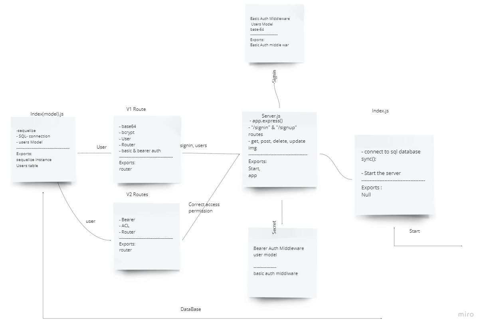

# auth-api

[pull request](https://github.com/JalalHasan-22/auth-api/pull/1)

[actions page](https://github.com/JalalHasan-22/auth-api/actions)

[Heroku app](https://jalal-auth-api.herokuapp.com/)

Authentication API

In this lab I have created a new authenticated server that has two routes, the first routes (V1) takes a basic authentication middleware and creating a new token with JWT.
the second routes (V2) takes the Bearer authentication middleware as well as the acl middleware which checks if the user has the permission to perform an action on a specific route.

I've created a user model, where I've created the schema of the table, and exported it to the index model. I also created a route file, where I handle the login and signup pages. I've implemented the signin process through a middleware called basic auth.

I've moved the databse functionalities to the user model itself, and implemented the use of the jwt, to check if a valid token, send a get request to the endpoint ("/secretstuff") with the correct token.

